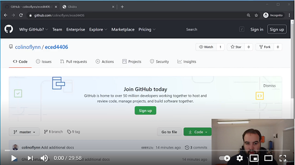

# Ghidra Setup

This folder includes a simplified Ghidra setup & quick demo.

You can see a [YouTube Video](https://www.youtube.com/watch?v=sNPFzVOS52Y) of the setup which goes through the setup + poking at the example file:

.

## Example File

Load the example file `basic-passwdcheck-CWLITEARM.hex` to start your exploration.

This firmware is from [ChipWhisperer Example Firmware](https://github.com/newaetech/chipwhisperer/tree/develop/hardware/victims/firmware), so you can get the source code example.

It had compiled in the following source code (useful to compare decompiled code to original source):

* [STM32F3 HAL](https://github.com/newaetech/chipwhisperer/tree/develop/hardware/victims/firmware/hal/stm32f3)
* [basic-passwdcheck.c](https://github.com/newaetech/chipwhisperer/tree/develop/hardware/victims/firmware/basic-passwdcheck)

The firmware is compiled for a STM32F303 Device, which the reference manual & SVD file have been included in this repo for.

The `basic-passwdcheck-CWLITEARM.elf` file can be loaded too, which will include debug information etc. You may find this useful as well in exploring how Ghidra works!

## SVD Loader Setup

You should install [SVD Loader](https://leveldown.de/blog/svd-loader/) if you want to have a hope of doing useful work with Ghidra easily.

An example SVD file for the STM32F303 device has been included in the repository to make it easier to get started once you set that up.